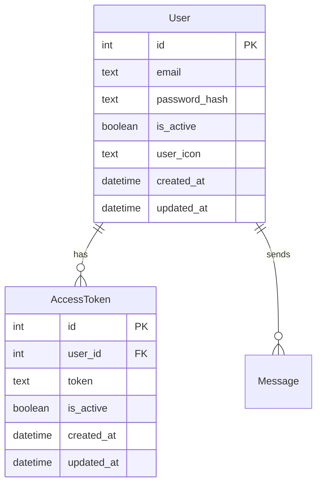

# electron-react-todos

## 開発環境起動

```bash
npm run build
npm run dev
```

## sqlite db

### 環境構築

```bash
npm i sqlite3\nnpm i -D @types/sqlite3\nnpm i sqlite
```

```bash
npm install @prisma/client
npm install prisma --save-dev
```

#### クライアントの生成

```bash
npx prisma init
# npx prisma generate
npm run prisma:generate
```

- 確認
  package.json

```json
{
  "type": "module"
  // ... 他の設定
}
```

### db 内容確認

```bash
sqlite3 db.sqlite
```

```bash
.tables
```

```bash
.schema users
```

```bash
SELECT * FROM users;
SELECT * FROM user_sessions;
```

```bash
.exit
```

### 認証機能の流れ

- \*1 平文のパスワードとハッシュ化されたパスワードを比較
- \*2 パスワードをハッシュ化
- \*3 パスワードをハッシュ化する hash 関数
- \*4 db にクエリを投げ、フロントエンドから得た情報と一致するデータを取得する関数(session, email, password)
  User.email === email(取得したもの)
  if ユーザーがいない
  パスワードが一致しない
  False
  それ以外
  return user

- \*5 アクセストークンを作成　(データ　有効期限)
  エンコード
  有効期限
  エンコードしたものに有効期限を設定
  jwt を作成
  jwt を返す

- \*6 現在のユーザー取得
  例外処理 401
  payload デコード処理
  email サブクレームからメールアドレス取得
  email がない場合 -> 例外処理 401
  トークンデータを取得(email)
  デコードに失敗した場合 -> 例外処理 401

アクセストークンが切れていないか
db クエリ->アクセストークン filter
token === token
is_active === True
expires_at > datatime.jstnow
最初のレコード取得

if アクセストークンがない
例外処理 401

- \*7 現在のアクティブなユーザーを取得
  if カレントユーザーがアクティブでない
  400 無効なユーザー
  そうでない
  現在のユーザーを返す

## テスト

1. ユーザー関連テスト
   ユーザー CRUD 操作
   ✅ 新規ユーザーの作成が正常に行われるか
   ✅ 同じメールアドレスのユーザーを重複して作成できないか
   ✅ ユーザー情報の取得（ID、メールアドレスによる）
   ✅ ユーザー情報の更新
   ✅ ユーザーの削除（または非アクティブ化）
   パスワード関連
   ✅ パスワードが適切にハッシュ化されて保存されるか
   ✅ 正しいパスワードで比較すると true が返るか
   ✅ 間違ったパスワードで比較すると false が返るか
   ✅ saltRounds の設定が適切か（ハッシュ化の強度）

2. 認証関連テスト
   ログイン認証
   ✅ 正しい認証情報でログインできるか
   ✅ 存在しないユーザーでログイン試行した場合の挙動
   ✅ 間違ったパスワードでログイン試行した場合の挙動
   ✅ 非アクティブユーザーでログイン試行した場合の挙動
   トークン管理
   ✅ トークン生成が正常に行われるか
   ✅ 有効期限の設定が正しいか
   ✅ トークンのペイロードに必要な情報が含まれるか
   ✅ 有効期限切れトークンの検証
   ✅ 改ざんされたトークンの検証

3. データベース操作テスト
   クエリ実行
   ✅ SQL インジェクション対策
   ✅ 複雑なクエリの実行結果
   ✅ トランザクション処理の整合性
   ✅ 大量データ操作時のパフォーマンス
   エラー処理
   ✅ DB 接続失敗時の挙動
   ✅ クエリ実行エラー時の挙動
   ✅ 外部キー制約違反時の挙動
   ✅ ユニーク制約違反時の挙動

4. マイグレーションテスト
   ✅ スキーマ変更が正しく適用されるか
   ✅ ダウングレードが正しく機能するか
   ✅ 既存データへの影響

5. 統合テスト
   ✅ 認証からユーザー情報取得までの一連のフロー
   ✅ DB 操作と他のビジネスロジックの連携
   ✅ エラー発生時の全体的な挙動

6. モック・スタブ利用
   ✅ DB 操作をモック化したユニットテスト
   ✅ インメモリ DB を使用したテスト環境
   ✅ テストデータの初期化と後処理


